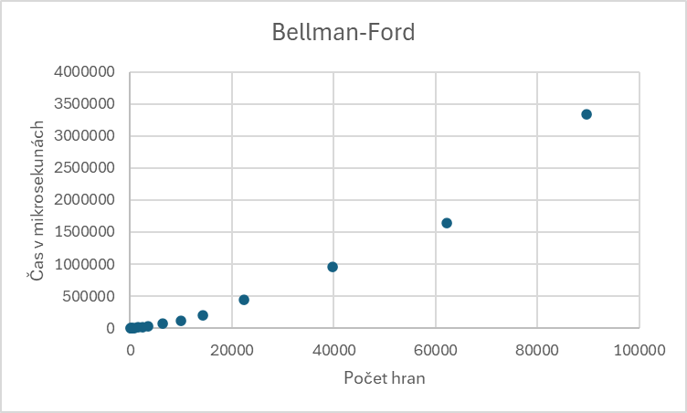

# Algoritmy Bellman-Ford a Dijkstra

V tomto dokumentu jsou shrnuty dva algoritmy pro hledání **nejkratší cesty** v grafech: **Bellman-Ford** a **Dijkstra**.

Poznámky:
- **V** = počet vrcholů v grafu
- **E** = počet hran v grafu

---


## Principy, využití a časová složitost

### Bellman-Ford
**Autor:** Lester Ford Jr. (1956), Richard Bellman (1958)  
**Účel:** Hledání nejkratších cest ze zdroje do všech vrcholů, i v grafech se zápornými hranami.

**Princip:**  
Bellman-Ford funguje na principu **relaxace hran**. Relaxace znamená, že pokud existuje cesta k vrcholu `u` a hrana `(u, v)` s váhou `w`, zkontrolujeme, zda cesta přes `u` je kratší než současná vzdálenost k `v`. Pokud ano, vzdálenost k `v` se aktualizuje.  
Algoritmus opakuje tuto relaxaci **V-1 krát**, protože nejdelší možná cesta bez cyklu má maximálně V-1 hran. Na závěr kontroluje, zda lze ještě vzdálenosti zkrátit – pokud ano, graf obsahuje **záporný cyklus**.

**Časová složitost:** O(V × E)  
**Využití:** Grafy se zápornými hranami, detekce záporných cyklů, ekonomické nebo dopravní modely s penalizacemi

### Dijkstra
**Autor:** Edsger W. Dijkstra (1959)  
**Účel:** Hledání nejkratších cest ze zdroje do všech vrcholů v grafech s **nezápornými hranami**.

**Princip:**  
Dijkstra také používá **relaxaci hran**, ale postupuje **greedily**, vždy zpracovává vrchol s aktuálně nejmenší známou vzdáleností. (pomocí prioritní fronty nebo haldy pro efektivní výběr).
1. Inicializace vzdáleností všech vrcholů na nekonečno, vzdálenost ke zdroji = 0.
2. Vytvoření množiny `Q` všech nezpracovaných vrcholů.
3. Dokud `Q` není prázdná, vybere se vrchol `u` s nejmenší vzdáleností a odstraní se z Q.
4. Pro každého souseda `v` vrcholu `u` se spočítá nová vzdálenost `alt = vzdalenost[u] + w(u,v)`. Pokud je `alt` menší než současná vzdálenost k `v`, vzdálenost se aktualizuje a zapamatuje se předchůdce.
5. Opakuje se, dokud nejsou všechny vrcholy zpracovány.

**Časová složitost:**
- Best case: O(V + E) s použitím haldy
- Worst case: O((V + E) log V) s prioritní frontou
- Jednoduchá implementace: O(V²)

**Využití:** Grafy s nezápornými hranami, navigace, síťové směrování, plánování tras

---
## Pseudokód
### Bellman-Ford
```pseudo
funkce BellmanFord(graf, start, cil):
    vzdalenost[v] = ∞ pro kazdy vrchol v
    vzdalenost[start] = 0
    predchudce[v] = -1

    pro i = 1 az V-1:
        pro kazdy vrchol u:
            pro kazdého souseda v vrcholu u:
                pokud vzdalenost[u] + w(u,v) < vzdalenost[v]:
                    vzdalenost[v] = vzdalenost[u] + w(u,v)
                    predchudce[v] = u

    kontrola zapornych cyklu
    sestav cestu od cil zpet pomoci predchudce
    navrat vzdalenost
   ```
### Dijkstra
```pseudo
funkce Dijkstra(graf, start, cil):
    vzdalenost[v] = ∞ pro kazdy vrchol v
    vzdalenost[start] = 0
    predchudce[v] = -1
    navstiven[v] = false

    dokud existuje nenavstiveny vrchol:
        vyber vrchol u s nejmenši vzdalenosti
        pokud vzdalenost[u] == ∞: break
        navstiven[u] = true

        pro kazdeho souseda v vrcholu u:
            pokud w(u,v) < 0: return "Chyba: zaporna hrana"
            pokud vzdalenost[u] + w(u,v) < vzdalenost[v]:
                vzdalenost[v] = vzdalenost[u] + w(u,v)
                predchudce[v] = u

    sestav cestu od cil zpet pomoci predchudce
    návrat vzdalenost[cil]
```
---
# Popis řešení práce

Cílem práce bylo implementovat algoritmy pro hledání **nejkratší cesty v grafu** – konkrétně **Bellman-Ford** a **Dijkstra**. Algoritmy vrací nejen vzdálenost mezi startovním a cílovým vrcholem, ale také samotnou cestu a měří čas výpočtu.

---

## 1. Třída Graph

Graf je reprezentován pomocí **seznamu sousedů**, každá hrana má cíl a váhu.

**Metody:**

- `Graph(int n)` – konstruktor, vytvoří graf s `n` vrcholy a prázdným seznamem sousedů.
- `addEdge(int from, int to, int weight)` – přidá hranu z vrcholu `from` do vrcholu `to` s danou váhou.
- `getNeighbors(int vertex)` – vrací seznam sousedů vrcholu a váhy hran; pokud je vrchol neplatný, vrací `{-1,-1}`.
- `getSize()` – vrací počet vrcholů grafu.
- `getAdjList()` – vrací celý seznam sousedů.

*Popis:* Třída umožňuje efektivně procházet všechny hrany a vrcholy grafu, což je nezbytné pro oba algoritmy.

---

## 2. Bellman-Ford

Hledá nejkratší cesty i v grafech se zápornými hranami a dokáže detekovat záporné cykly.

**Metoda:**

- `shortestPath(const Graph& graph, int start, int end)` – vrací pár (`status, vzdálenost`).
    - Inicializuje vzdálenosti a předchůdce.
    - Relaxuje všechny hrany **V-1 krát**.
    - Kontroluje záporné cykly.
    - Rekonstruuje cestu od cíle zpět a vrací vzdálenost.

**Postup podle implementace:**

1. **Inicializace:**
    - Vytvoří pole `distances[]` s velikostí počtu vrcholů grafu, všechny hodnoty jsou `INT_MAX`, startovní vrchol má `0`.
    - Vytvoří pole `parent[]` pro sledování předchůdců vrcholů, všechny hodnoty jsou `-1`.

2. **Relaxace hran:**
    - Iteruje **V-1 krát**, kde V je počet vrcholů.
    - Pro každý vrchol `u` prochází všechny jeho sousedy `v` a provede relaxaci:

3. **Kontrola záporných cyklů:**
    - Po dokončení relaxace všech hran zkontroluje, zda neexistuje hrana, která by ještě zlepšila vzdálenost.
    - Pokud ano, znamená to existenci záporného cyklu a algoritmus vrátí `"Negative weight cycle detected"`.

4. **Rekonstrukce cesty:**
    - Pokud je cílový vrchol nedosažitelný (`distances[end] == INT_MAX`), vrátí `"Unreachable"`.
    - Jinak sestaví cestu od cílového vrcholu zpět pomocí pole `parent[]`.

5. **Výpis výsledků:**
    - Vypíše nejkratší cestu a vzdálenost.
    - Změří a zobrazí čas běhu algoritmu v mikrosekundách.

**Výstup:**
- Nejkratší vzdálenost mezi `start` a `end`.
- Možnost rekonstruovat cestu přes pole `parent[]`.
- Informace o záporném cyklu nebo nedosažitelnosti cíle.

---

## 3. Dijkstra

Hledá nejkratší cesty v grafech bez záporných hran.

**Metoda:**

- `shortestPath(const Graph& graph, int start, int end)` 
    - Vrací vzdálenost z `start` do `end`.
    - Inicializuje vzdálenosti, předchůdce a pole navštívených vrcholů.
    - Iterativně vybírá vrchol s nejmenší známou vzdáleností.
    - Relaxuje hrany a aktualizuje vzdálenosti a předchůdce.
    - Rekonstruuje cestu a měří čas běhu.

1. **Inicializace:**
    - Vytvoří pole `distances[]` s velikostí počtu vrcholů grafu, všechny hodnoty jsou `INT_MAX` kromě startovního vrcholu, který má `0`.
    - Vytvoří pole `parent[]` pro sledování předchůdců vrcholů (pro rekonstrukci cesty), všechny hodnoty nastaví na `-1`.
    - Vytvoří pole `visited[]` pro sledování navštívených vrcholů.
    - Nastaví `currentVertex` na startovní vrchol a `visitedCount` na `0`.

2. **Inicializace sousedů startovního vrcholu:**
    - Pro každého souseda `v` startovního vrcholu nastaví počáteční vzdálenost `distances[v] = w(start,v)` a `parent[v] = start`.

3. **Hlavní smyčka (dokud nejsou všechny vrcholy navštíveny):**
    - Vybere nenavštívený vrchol s nejmenší vzdáleností (`currentVertex`).
    - Pokud žádný vrchol není dosažitelný (`minDistance == INT_MAX`), algoritmus končí.
    - Označí vrchol jako navštívený a zvýší `visitedCount`.

4. **Relaxace hran:**
    - Pro všechny sousedy vrcholu `currentVertex`:
        - Pokud je hrana záporná, vypíše chybu a ukončí algoritmus.
        - Pokud je nalezena kratší cesta přes `currentVertex`, aktualizuje vzdálenost a předchůdce:

5. **Konec smyčky a rekonstrukce cesty:**
    - Pokud je cílový vrchol nedosažitelný (`distances[end] == INT_MAX`), vrátí `-1`.
    - Jinak sestaví cestu od cílového vrcholu zpět pomocí pole `parent[]`.

6. **Výpis výsledků:**
    - Vypíše nejkratší cestu a vzdálenost.
    - Vypočítá a zobrazí čas běhu algoritmu v mikrosekundách.


**Metoda:**
 - `void exportFinalGraph(const Graph& graph, int start, int end, const vector<int>& parent)`

Slouží k exportu grafu do **DOT souboru**, kde jsou všechny hrany a nejkratší cesta zvýrazněna červeně.
Exportovaný soubor je v cmake-build-debug a název souboru je `final_graph_dijkstra_start_cil.dot` .
**Parametry:**

- `graph` – graf reprezentovaný třídou Graph
- `start` – startovní vrchol
- `end` – cílový vrchol
- `parent` – pole předchůdců vrcholů pro rekonstrukci cesty

**Postup:**
 - Pro reprezentaci grafu je použit formát DOT, který je kompatibilní s knihovnou Graphviz.
1. Vytvoří DOT soubor s názvem obsahujícím start a cíl.
2. Pro každý vrchol a jeho hrany zkontroluje, zda hrana patří do nejkratší cesty.
3. Hrany nejkratší cesty se označí červeně, ostatní černě.
4. Soubor se uloží a lze ho vizualizovat 

---
## 4. MainHelpers
### MainHelpers – extrahování funkcí pro main a testy

Slouží k extrahování funkcí pro main a umožňuje jejich použití i v testech.

---

### 1. Funkce pro bezpečné čtení vstupu

### `int readIntInRange(const string &prompt, int minValue, int maxValue)`
- Bezpečně načítá celé číslo v zadaném rozsahu `[minValue, maxValue]`.
- Parametry:
    - `prompt` – text pro výzvu uživateli.
    - `minValue` – minimální povolená hodnota.
    - `maxValue` – maximální povolená hodnota.
- Funkce opakuje čtení, dokud uživatel nezadá platné číslo, jinak program skončí s chybou.

### `int readInt(const string &prompt)`
- Načítá celé číslo větší než 0 (např. pro váhy hran).
- Parametr:
    - `prompt` – text pro výzvu uživateli.
- Opakuje čtení, dokud není zadán platný integer, jinak program skončí s chybou.

---

### 2. Funkce pro načtení grafu

### `Graph loadGraphFromArgs(int argc, char* argv[], int startIndex, int& outVertices)`
- Načte graf z argumentů příkazové řádky v režimu `--manual`.
- První argument je počet vrcholů, následují hrany jako trojice `u v w`.
- Parametry:
    - `argc`, `argv` – standardní parametry main.
    - `startIndex` – index prvního argumentu obsahujícího počet vrcholů.
    - `outVertices` – výstupní počet vrcholů.
- Vrací objekt `Graph` s načtenými hranami.
- Provádí kontrolu platnosti vrcholů a typů vstupu.

### `Graph loadGraphFromFile(const string& filename)`
- Načte graf ze souboru, každý řádek musí obsahovat `u v w`.
- Automaticky nastaví velikost grafu podle největšího vrcholu.
- Parametr:
    - `filename` – cesta k souboru.
- Vrací: objekt `Graph` s načtenými hranami.
- Pokud soubor nelze otevřít, program skončí s chybou.

### `void loadGraphManual(Graph& g)`
- Načte graf manuálně ze standardního vstupu.
- Uživatel zadává počet hran, pak každou hranu jako `u v w`.
- Provádí kontrolu platnosti vrcholů a váhy hran.

### `int getInputVertices()`
- Načte počet vrcholů grafu od uživatele.
- Používá `readIntInRange` pro bezpečné zadání (1–10000).

---

### 3. Funkce pro nápovědu

#### `void helperFunction()`

Vypíše informace o použití programu:

- Režimy načítání grafu: `--file`, `--stdin`, `--manual`.
- Výběr algoritmu: `--algo <dijkstra|bellman>`.
- Příznak `--help` pro zobrazení nápovědy.

### Popis příznaků

| Příznak | Popis |
|---------|-------|
| `--file <filename>` | Načte graf ze souboru. Každý řádek souboru musí obsahovat `u v w` (odkud, kam, váha hrany). |
| `--stdin` | Načte graf ze standardního vstupu. Hrany se zadávají ve formátu `u v w`. |
| `--manual` | Umožní manuální zadání grafu. Program se zeptá na počet hran a poté je zadáte postupně. |
| `--algo <name>` | Určuje algoritmus pro výpočet nejkratší cesty. Hodnoty: `dijkstra` nebo `bellman`. |
| `--help` | Zobrazí tuto nápovědu a ukončí program.

---

## 5. Main program

- **Argumenty programu:**
    - `--help` – zobrazí nápovědu a ukončí program.
    - `--file <filename>` – načte graf ze souboru.
    - `--stdin` – načte graf ze standardního vstupu.
    - `--manual` – umožní manuální zadání grafu.
    - `--algo <dijkstra|bellman>` – určí, který algoritmus použít.

- **Postup programu:**
    1. Zkontroluje, zda byly zadány argumenty, případně vypíše chybu.
    2. Na základě příznaků nastaví režim načítání grafu a algoritmus.
    3. Načte graf (soubor / stdin / manuálně).
    4. Bezpečně načte startovní a cílový vrchol.
    5. Spustí zvolený algoritmus:
        - **Dijkstra:** `Dijkstra::shortestPath(graph, start, end)`
            - Vypíše vzdálenost a cestu.
            - Pokud je cílový vrchol nedosažitelný, vypíše chybu.
        - **Bellman-Ford:** `BellmanFord::shortestPath(graph, start, end)`
            - Vypíše vzdálenost a cestu.
            - Detekuje záporné cykly.
    6. V případě neznámého algoritmu vypíše chybu.
    7. Program končí návratovou hodnotou `0` při úspěchu, `1` při chybě.

- **Výstup programu:**
    - Nejkratší vzdálenost mezi zadanými vrcholy.
    - Nejkratší cesta (sekvence vrcholů).
    - Informace o nedosažitelnosti cíle nebo záporném cyklu (pro Bellman-Ford).

---

# Kompilace, ovládání, spuštění programu
- Když kompilace nebude procházet kvůli tomu, že nejde načíst soubor, zkopírujte soubor do cmake-build-debug.
## Kompilace
### Požadavky

- Kompilátor podporující C++11 nebo novější (např. GCC, Clang, MSVC).
- Standardní knihovny C++ (`iostream`, `vector`, `fstream`, `limits`, `chrono`).

### Kompilace pomocí GCC

Příklad příkazu pro kompilaci všech souborů:

```bash
g++ -std=c++17 main.cpp Graph.cpp Dijkstra.cpp BellmanFord.cpp -o shortest_path
```
Po zdařené kompilaci lye program spustit z příkazové řádky:

(níže jsou uvedeny příkladz spuštění se všemi požadovanými způsoby načítání vstupu)

```bash
manual
--manual 4 0 1 5 1 2 3 2 3 2 --algo dijkstra
--manual 5 0 1 2 1 2 3 2 0 1 2 3 4 --algo bellman
--manual 3 0 1 4 --algo dijkstra

file
--file full_test1.txt --algo dijkstra
--file full_test5.txt --algo bellman
--file full_test10.txt --algo bellman

stdin
--stdin --algo bellman
--stdin --algo dijkstra

```
Ukázka spuštění s --stdin


nebo lze kompilaci a spuštění provést přímo v prostředí CLION zadáním argumentů(v tomto případě konfigurace 'pcc-semestralka') do konfigurace spuštění:


---

# Testování
## Test cases
### 1. Dijkstra

- **`Dijkstra - simple graph with positive edges`**
    - Testuje základní graf s kladnými hranami.
    - Ověřuje správnou délku nejkratší cesty a její strukturu.
  
- **`Dijkstra - unreachable vertex`**
    - Testuje situaci, kdy cílový vrchol není dosažitelný.
  
- **`Dijkstra - graph with cycle`**
    - Testuje graf obsahující cyklus, ověřuje, že algoritmus najde nejkratší cestu.

- **`Dijkstra - negative edge should fail`**
    - Testuje chování algoritmu při záporné hraně (algoritmus ji nepodporuje, vrací -1).

- **`Dijkstra - large sparse graph performance`**
    - Testuje výkon algoritmu na velkém řetězovém grafu.

### 2. Bellman-Ford

- **`Bellman-Ford - basic positive edges`**
    - Testuje základní graf s kladnými hranami.
  
- **`Bellman-Ford - negative edges without cycle`**
    - Testuje graf se zápornými hranami, ale bez záporného cyklu.
    - Ověřuje správnou vzdálenost nejkratší cesty.
  
- **`Bellman-Ford - detects negative weight cycle`**
    - Testuje detekci záporného cyklu.
  
- **`Bellman-Ford - unreachable vertex`**
    - Testuje situaci, kdy cílový vrchol není dosažitelný.
  
- **`Bellman-Ford - large dense graph performance`**
    - Testuje výkon na velkém hustém grafu s kladnými hranami.
  
### 3. Main 

- **`Main - file input with Dijkstra`**
    - Testuje načtení grafu ze souboru.
    - Ověřuje správnou vzdálenost nejkratší cesty pomocí Dijkstra algoritmu.
- **`Main - file input with Bellman-Ford`**
    - Testuje načtení grafu ze souboru.
    - Ověřuje správnou vzdálenost nejkratší cesty pomocí Bellman-Ford algoritmu.
- **`Main - manual input Dijkstra`**
    - Testuje manuální zadání hran grafu.
    - Ověřuje správnou vzdálenost nejkratší cesty pomocí Dijkstra algoritmu.
- **`Main - manual input Bellman-Ford`**
    - Testuje manuální zadání hran grafu.
    - Ověřuje správnou vzdálenost nejkratší cesty pomocí Bellman-Ford algoritmu.
- **`Main - stdin simulation Dijkstra`**
    - Simuluje načítání hran ze standardního vstupu.
    - Ověřuje správný výpočet nejkratší cesty pomocí Dijkstra algoritmu.
- **`Main - stdin simulation Bellman-Ford`**
    - Simuluje načítání hran ze standardního vstupu.
    - Ověřuje správný výpočet nejkratší cesty pomocí Bellman-Ford algoritmu.
- **`Main - unreachable vertex`**
    - Testuje situaci, kdy cílový vrchol není dosažitelný.
    - Kontroluje, že Dijkstra vrací `-1` a Bellman-Ford vrací `"Unreachable"`.
- **`Main - negative edge Dijkstra should fail`**
    - Testuje graf se zápornou hranou.
    - Zajišťuje, že Dijkstra vrací `-1` (záporné hrany nejsou povoleny).
- **`Main - helper function output`**
    - Testuje funkci `helperFunction()` pro výpis nápovědy programu.
    - Ověřuje, že výstup obsahuje hlavní možnosti programu (`--file`, `--algo`, atd.).
### Pomocná funkce pro ověření cest

- `verifyPath(const Graph& g, const vector<int>& path, int expectedDistance)`
    - Kontroluje, zda je cesta platná a zda má očekávanou délku.

### Vstupní soubory

Pro testování režimu `--file` jsou připraveny testovací soubory full_test1.txt, full_test2.txt, ..., full_test15.txt

## Spuštění testů

### Testovací konfigurace
- Když testy nebudou procházet kvůli tomu, že nejde načíst soubor, zkopírujte soubor do cmake-build-debug.

Složka **`tests/`** obsahuje:

- `catch.h` – hlavičkový soubor Catch2.
- `catch.cpp` – implementace Catch2.
- `tests.h` - hlavičkový soubor tests.cpp.
- `tests.cpp` – samotné testovací případy s assert funkcemi (`REQUIRE`).
- `CMakeLists.txt` - konfigurace pro kompilaci testů.

---

# Srovnání obou algoritmů
### Přehled testovacích grafů pro Dijkstra a Bellman-Ford
- Měření proběhlo vůči kódu v commitu 3b11aea8, na 8 jádrovém AMD Ryzen 7 6800H CPU taktovaném na 3.2 GHz a s vypnutým SMT, na notebooku ThinkPad E14 Gen 6.
- Pro měření časů běhu byly použity testovací grafy s následujícími vlastnostmi:
  - Graf je orientovaný.
  - Všechny hrany mají kladné váhy.
  - Graf je úplný (každý vrchol je spojen s každým jiným vrcholem) - tedy je dosaženo maximálního počtu hran.

| Testovací soubor     | Vrcholy | Hrany   | Měřená cesta  |
|---------------------|---------|---------|---------------|
| full_test1.txt       | 5       | 10      | 0 → 4         |
| full_test2.txt       | 10      | 90      | 0 → 9         |
| full_test3.txt       | 15      | 210     | 0 → 14        |
| full_test4.txt       | 20      | 380     | 0 → 19        |
| full_test5.txt       | 30      | 870     | 0 → 29        |
| full_test6.txt       | 40      | 1560    | 0 → 39        |
| full_test7.txt       | 50      | 2450    | 0 → 49        |
| full_test8.txt       | 60      | 3540    | 0 → 59        |
| full_test9.txt       | 80      | 6320    | 0 → 79        |
| full_test10.txt      | 100     | 9900    | 0 → 99        |
| full_test11.txt      | 120     | 14280   | 0 → 119       |
| full_test12.txt      | 150     | 22350   | 0 → 149       |
| full_test13.txt      | 200     | 39800   | 0 → 199       |
| full_test14.txt      | 250     | 62150   | 0 → 249       |
| full_test15.txt      | 300     | 89700   | 0 → 299       |

### Výsledky měření časů běhu
- Časy běhu jsou uvedeny v mikrosekundách (μs).

| Testovací soubor     | Dijkstra (μs) | Bellman-Ford (μs) |
|---------------------|---------------|-------------------|
| full_test1.txt       | 39            | 59                |
| full_test2.txt       | 67            | 314               |
| full_test3.txt       | 128           | 915               |
| full_test4.txt       | 185           | 1717              |
| full_test5.txt       | 229           | 3983              |      
| full_test6.txt       | 457           | 10714             |
| full_test7.txt       | 720           | 16238             |
| full_test8.txt       | 1212          | 24992             |
| full_test9.txt       | 1532          | 71437             |
| full_test10.txt      | 1947          | 119334            |
| full_test11.txt      | 2934          | 199260            |
| full_test12.txt      | 4272          | 436831            |
| full_test13.txt      | 6868          | 956858            |
| full_test14.txt      | 7866          | 1642036           |
| full_test15.txt      | 11560         | 3344342           |

### Grafické znázornění výsledků




### Závěr srovnání
- **Dijkstra** je výrazně rychlejší než **Bellman-Ford** na grafech s kladnými hranami, což odpovídá jeho časové složitosti O((V + E) log V) oproti O(V × E) u Bellman-Ford.
- Rozdíl v časech běhu se zvyšuje s velikostí grafu, což potvrzuje teoretické předpoklady o efektivitě obou algoritmů.
- Když graf obsahuje záporné hrany, je nutné použít Bellman-Ford, i když je pomalejší.
- Pro aplikace, kde jsou všechny hrany kladné je Dijkstra vhodnější.


